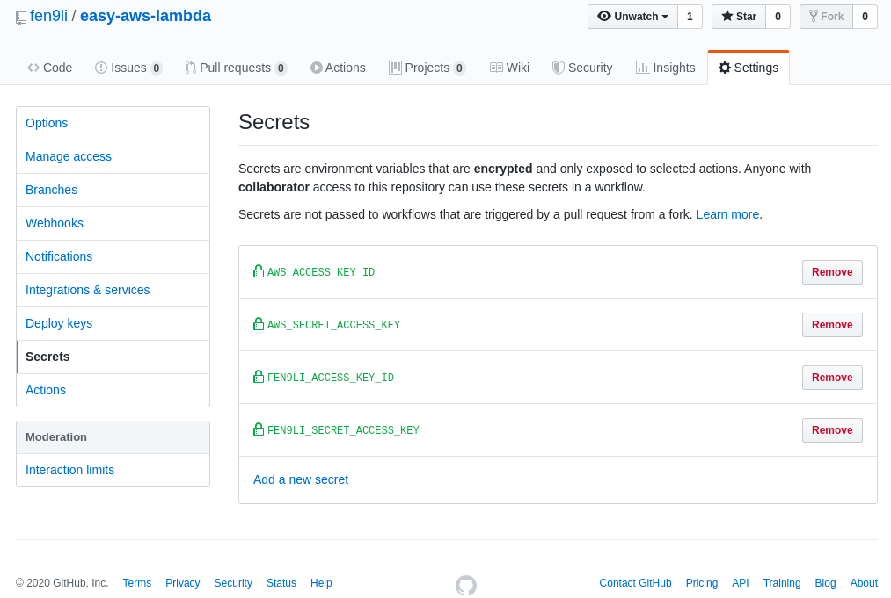

# easy-aws-lambda
run aws cli from aws lambda function

## setup

* create repo


* clone to local
```
(env) [fli@192-168-1-4 ~]$ git clone git@github.com:fen9li/easy-aws-lambda.git
Cloning into 'easy-aws-lambda'...
Warning: Permanently added the RSA host key for IP address '13.236.229.21' to the list of known hosts.
remote: Enumerating objects: 4, done.
remote: Counting objects: 100% (4/4), done.
remote: Compressing objects: 100% (4/4), done.
remote: Total 4 (delta 0), reused 0 (delta 0), pack-reused 0
Receiving objects: 100% (4/4), 4.53 KiB | 4.53 MiB/s, done.
(env) [fli@192-168-1-4 ~]$ cd easy-aws-lambda/
(env) [fli@192-168-1-4 easy-aws-lambda]$ ll
total 16
drwxrwxr-x. 2 fli fli     6 Mar 13 12:19 images
-rw-rw-r--. 1 fli fli 11357 Mar 13 12:19 LICENSE
-rw-rw-r--. 1 fli fli    55 Mar 13 12:19 README.md
(env) [fli@192-168-1-4 easy-aws-lambda]$ 
```

* add aws access credentials to github secrets

> Note: seems github action `aws-actions/configure-aws-credentials@v1` accepts only FIXED SECRETS NAME `${{ secrets.AWS_ACCESS_KEY_ID }}` & `${{ secrets.AWS_SECRET_ACCESS_KEY }}`. Have tried with `${{ secrets.FEN9LI_ACCESS_KEY_ID }}` & `${{ secrets.FEN9LI_SECRET_ACCESS_KEY }}`, BUT FAILED. 



* setup actions workflow

```
mkdir -p .github/workflows
```

* git housekeeping and see the actions workflow starts as expected


