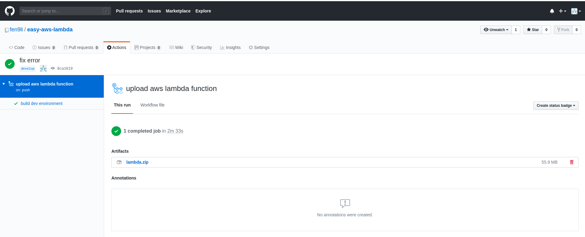

# setup

## create s3 bucket to home lambda function stack templates

> Note: create this s3 bucket manually    
> Note: both dev and prod environments will use this bucket   

* create `lambda-function-stack-templates-home` with tags
```
aws s3 mb s3://lambda-function-stack-templates-home --profile fen9li

aws s3api put-bucket-tagging --bucket lambda-function-stack-templates-home --tagging 'TagSet=[{Key=Createdby,Value=fen9li},{Key=Project,Value=Provision-AWS-via-Lambda-Function}]' --profile fen9li
```

## create s3 buckets to home lambda function zipfile

> Note: create these s3 bucket manually    
> Note: `lambda-function-zipfile-home-dev` for develop environment and `lambda-function-zipfile-home-prod` for production environment

* create `lambda-function-zipfile-home-x` with tags
```
aws s3 mb s3://lambda-function-zipfile-home-dev --profile fen9li

aws s3api put-bucket-tagging --bucket lambda-function-zipfile-home-dev --tagging 'TagSet=[{Key=Createdby,Value=fen9li},{Key=Project,Value=Provision-AWS-via-Lambda-Function},{Key=ChargeTo,Value=dev}]' --profile fen9li

aws s3 mb s3://lambda-function-zipfile-home-prod --profile fen9li

aws s3api put-bucket-tagging --bucket lambda-function-zipfile-home-prod --tagging 'TagSet=[{Key=Createdby,Value=fen9li},{Key=Project,Value=Provision-AWS-via-Lambda-Function},{Key=ChargeTo,Value=dev}]' --profile fen9li
```

## create s3 buckets to home simple sinatra stack template

> Note: create these s3 bucket manually    
> Note: `simple-sinatra-stack-templates-home-dev` for develop environment and `simple-sinatra-stack-templates-home-prod` for production environment

* create `simple-sinatra-stack-templates-home-x` with tags
```
aws s3 mb s3://simple-sinatra-stack-templates-home-dev --profile fen9li

aws s3api put-bucket-tagging --bucket simple-sinatra-stack-templates-home-dev --tagging 'TagSet=[{Key=Createdby,Value=fen9li},{Key=Project,Value=simple-sinatra},{Key=ChargeTo,Value=dev}]' --profile fen9li

aws s3 mb s3://simple-sinatra-stack-templates-home-prod --profile fen9li

aws s3api put-bucket-tagging --bucket simple-sinatra-stack-templates-home-prod --tagging 'TagSet=[{Key=Createdby,Value=fen9li},{Key=Project,Value=simple-sinatra},{Key=ChargeTo,Value=dev}]' --profile fen9li
```

## (optional) zip dependency package and upload the zip file to GitHub as artifacts

* create `Dockerfile`, `entrypoint.sh ` &  `requirements.txt`
```
[fli@192-168-1-4 package]$ pwd
/home/fli/easy-aws-lambda/.github/package
[fli@192-168-1-4 package]$ tree
.
├── Dockerfile
├── entrypoint.sh
└── requirements.txt

0 directories, 3 files
[fli@192-168-1-4 package]$ 

[fli@192-168-1-4 easy-aws-lambda]$ cat .github/package/Dockerfile 
FROM amazonlinux:2017.03
RUN yum -y install git \
    python36 \
    python36-pip \
    zip \
    && yum clean all

RUN python3 -m pip install --upgrade pip 

COPY entrypoint.sh /entrypoint.sh
COPY requirements.txt /requirements.txt

ENTRYPOINT ["sh", "/entrypoint.sh"]

[fli@192-168-1-4 easy-aws-lambda]$   
[fli@192-168-1-4 easy-aws-lambda]$ cat .github/package/entrypoint.sh 
#!/bin/bash
mkdir dist
python3 -m pip install -r /requirements.txt -t dist 
 
cd dist
zip -r lambda.zip *
[fli@192-168-1-4 easy-aws-lambda]$ cat .github/package/requirements.txt 
boto3
[fli@192-168-1-4 easy-aws-lambda]$ 
```

* update `.github/workflows/deploy-to-aws-dev.yml` as below to create and upload artifacts

```
[fli@192-168-1-4 easy-aws-lambda]$ cat .github/workflows/deploy-to-aws-dev.yml 
name: upload aws lambda function

on: 
  push:
    branches:
    - develop
    - feature

jobs:
  build:
    name: build dev environment 
    runs-on: ubuntu-latest

    steps:
    - name: Checkout Repository
      uses: actions/checkout@v2
    - name: package lambda function dependency into zip file
      uses: ./.github/package    
    - name: Archive lambda function dependency packages zip file artifacts
      uses: actions/upload-artifact@v1
      with:
        name: lambda.zip
        path: dist
```

* commit and push to trigger the workflow

Check the artifacts in `repo` - `Actions` - `workflow` - `This run`



## reference
[How can I create an Amazon S3 notification configuration for Lambda on an existing Amazon S3 bucket using AWS CloudFormation](https://aws.amazon.com/premiumsupport/knowledge-center/cloudformation-s3-notification-lambda/)

[An easier way to build AWS Lambda deployment packages — with Docker instead of EC2](https://blog.quiltdata.com/an-easier-way-to-build-lambda-deployment-packages-with-docker-instead-of-ec2-9050cd486ba8)
